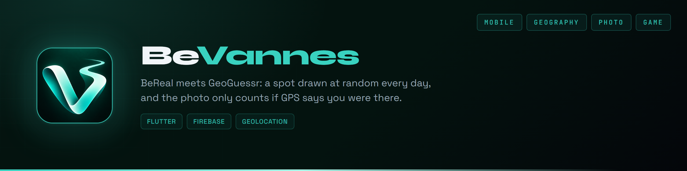
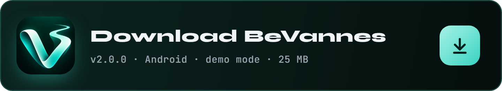
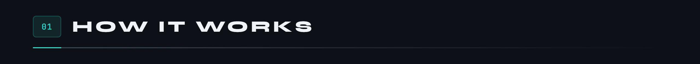
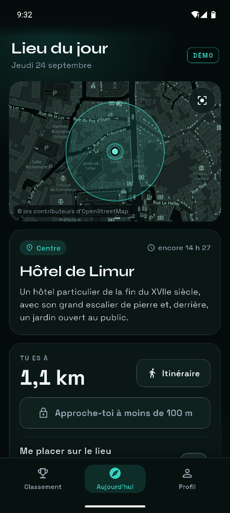
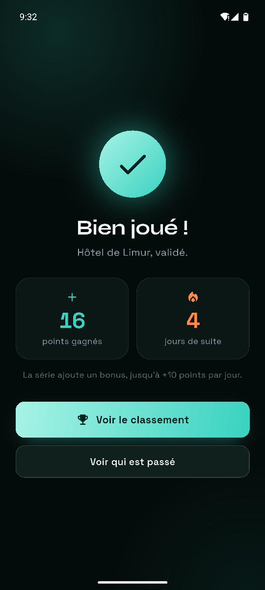
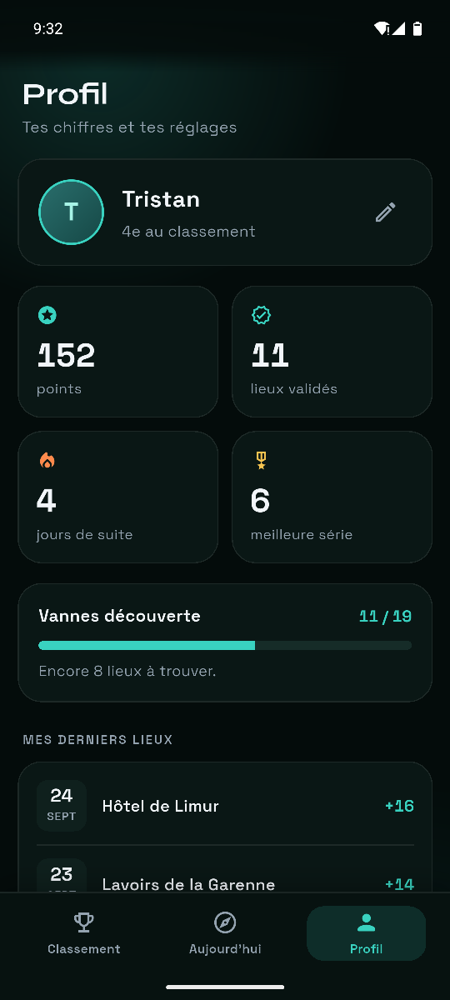
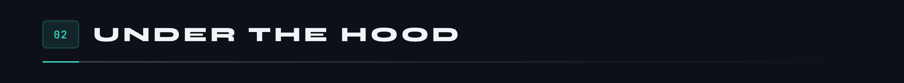
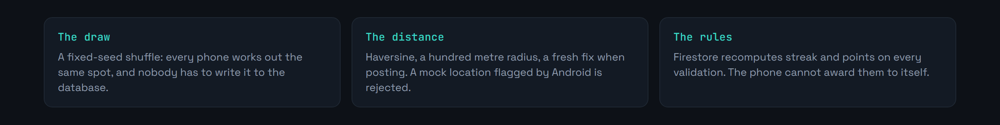
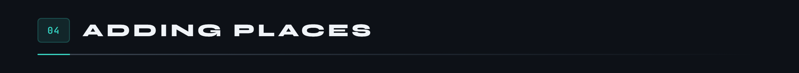
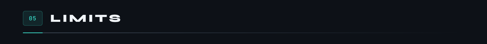

<div align="center">

<p>
  <a href="README.md"></a>
  
</p>



<a href="https://github.com/Cybertrist/BeVannes/releases/latest/download/BeVannes.apk"></a>

</div>

**BeReal meets GeoGuessr: one place a day, and you have to go there to score.**

Every day, the app picks a place in Vannes, the same one for everyone. To score, you have to go there: the photo is only accepted within a hundred metres of the spot, GPS as proof. Each place comes with a short historical note, which quietly turns the game into a guided tour.

The starting idea: we walk past the same streets every day without ever stopping. A playful constraint is sometimes enough to change that.




<p align="center">
  
  
  
  
</p>

> The screenshots show the app in French, the only language it ships in.



A Flutter app for Android, with Firebase behind it: Authentication for accounts, Firestore for players and validations, Storage for photos. The map comes from OpenStreetMap, no API key needed.

Three pieces hold the game together.



The code is layered: `lib/domain` holds the game rules, free of Flutter and Firebase, and tested; `lib/data` holds storage, with a Firebase version and an in-memory demo version; `lib/ui` holds the screens. Photos are cropped to 3:4 on the phone before upload, so everyone sees the same frame.


**To try it**, the button at the top installs the demo build: a small made-up community, everything stays on the phone, and a switch puts the player on today's spot to test validation without crossing town.

**To build it**, you need Flutter.

```bash
git clone https://github.com/Cybertrist/BeVannes.git
cd BeVannes
flutter pub get
flutter run --dart-define=DEMO=true
```

**To play for real**, you need a Firebase project.

1. On the [Firebase console](https://console.firebase.google.com/), enable **Authentication** (email and password), **Firestore** and **Storage**, and register an Android app `fr.bevannes.bevannes`.
2. Download its `google-services.json`, then write the build configuration, which git ignores:

```bash
bash tool/firebase_env.sh path/to/google-services.json
```

3. Deploy the rules and indexes from the repository:

```bash
firebase deploy --only firestore,storage
```

4. Build:

```bash
flutter build apk --release --dart-define-from-file=firebase.env.json
```

> Client-side Firebase API keys are not secrets, they can be read from any APK. What protects the data are the **rules** in `firestore.rules` and `storage.rules`: a player only writes their own points, recomputed by the server, and only sees a day's photos after validating that day themselves.



Places live in `assets/lieux.json`, bundled with the app.

```json
{
  "id": "lavoirs-garenne",
  "nom": "Lavoirs de la Garenne",
  "quartier": "Les remparts",
  "latitude": 47.6555828,
  "longitude": -2.7554577,
  "note": "Sous leurs toits d'ardoise, au bord de la Marle, les lavandières rinçaient le linge jusqu'au milieu du XXe siècle."
}
```

Take the coordinates from OpenStreetMap, not by eye: with a hundred metre radius, a misplaced spot becomes impossible to validate. The `note` is not decoration either, it is what separates a treasure hunt from a visit.

The order of the file feeds the draw: adding a place reshuffles the current cycle. Every player therefore needs the same app version to see the same spot.



The playing field is Vannes. Anywhere else, there is nothing to discover.

The position is whatever the phone reports. Android flags mock-location apps, and the game rejects them, but a modified phone can lie without saying so. The Firestore rules guarantee that points add up, not that the player was there.

Photos are not moderated, and OpenStreetMap's tiles are not meant for heavy traffic: beyond a circle of friends, it would take a tile server of your own.

Written in Flutter and Dart, with Firebase. MIT licence.

---

<sub>Student project · Université Bretagne Sud, Vannes · Tristan Joncour</sub>
