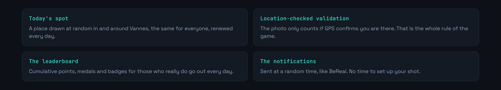

<div align="center">

<p>
  <a href="README.md"></a>
  
</p>


</div>

**BeReal meets GeoGuessr: one place a day, and you have to go there to score.**

Every day, the app draws a place at random in and around Vannes. To score, you have to physically go there: your GPS position is compared with the spot's, and the photo is only accepted if you really are on site. Each place comes with a historical or cultural note, which quietly turns the game into a guided tour.

The starting idea: we walk past the same streets every day without ever stopping. A playful constraint is sometimes enough to change that.




<div align="center">


</div>

> The screenshots show the app in French, the only language it ships in.


Built with Flutter, prototyped on FlutterFlow, backed by Firebase for authentication, the realtime database and the scheduled jobs.

Three home-made functions carry the game logic.


That is where it all plays out. Too wide a tolerance and you validate from your sofa; too narrow and GPS noise in town makes the game unplayable.


```bash
git clone https://github.com/Cybertrist/BeVannes.git
cd BeVannes
flutter pub get
```

**Firebase.** The project needs your own Firebase project: the configuration files are not in git.

1. Create a project on the [Firebase console](https://console.firebase.google.com/).
2. Enable **Authentication**, **Realtime Database** and **Storage**.
3. Download `google-services.json` and drop it in `android/app/`.
4. For iOS, `GoogleService-Info.plist` goes in `ios/Runner/`.

> Client-side Firebase API keys are not secrets, they are readable in any APK. What actually protects the data are the Realtime Database and Storage **security rules**. Set them up before opening the app to anyone.

```bash
flutter run
```


The spots are described in `data/spots.json`.

```json
{
  "spots": [
    {
      "name": "Les remparts",
      "latitude": 47.6553,
      "longitude": -2.7601,
      "description": "Fortifications médiévales, parmi les mieux conservées de Bretagne."
    }
  ]
}
```

The `description` is not decoration: it is what separates a treasure hunt from a visit. It deserves some care.


The area covered is Vannes and its surroundings. Anywhere else, there is nothing to discover.

Validation rests on the device GPS, which a mock-location app can still fake. A serious check would need server-side cross-referencing, on the time of the shot and the plausibility of the movement.

The project grew out of a FlutterFlow prototype, and part of the generated code was never rewritten by hand.

Written in Flutter and Dart, with Firebase. MIT licence.

---

<sub>Student project · Université Bretagne Sud, Vannes · Tristan Joncour</sub>
