<div align="center">

<p>
  <a href="README.md"></a>
  
</p>

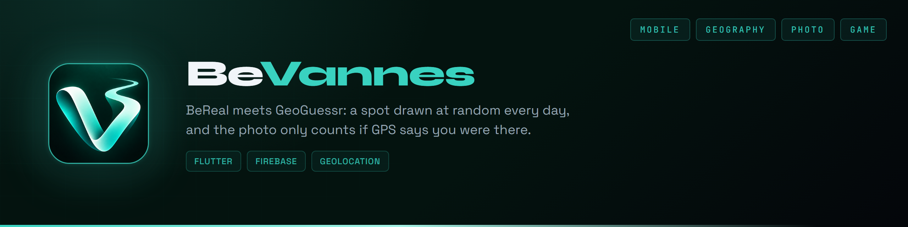
<br><br>

**BeReal meets GeoGuessr: one place a day, and you have to go there to score.**

</div>

Every day, the app picks a place in Vannes, the same one for everyone. To score, you have to go there: the photo is only accepted within a hundred metres of the spot, GPS as proof. Each place comes with a short historical note, which quietly turns the game into a guided tour.

The starting idea: we walk past the same streets every day without ever stopping. A playful constraint is sometimes enough to change that.

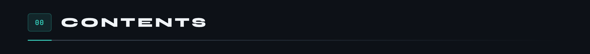

<p align="center">
<a href="#features"></a>
<a href="#screens"></a>
<a href="#install">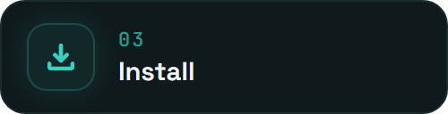</a>
<br>
<a href="#todays-spot"></a>
<a href="#on-site"></a>
<a href="#photo"></a>
<br>
<a href="#wall"></a>
<a href="#points"></a>
<a href="#reminder"></a>
<br>
<a href="#rules"></a>
<a href="#privacy"></a>
<a href="#architecture"></a>
<br>
<a href="#places"></a>
<a href="#tests">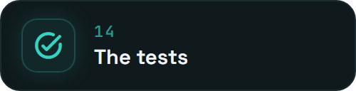</a>
<a href="#versions"></a>
</p>

<a id="features"></a>
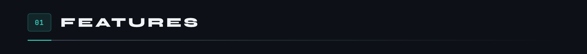


Three pieces hold the game together, and each one gets its own part below.

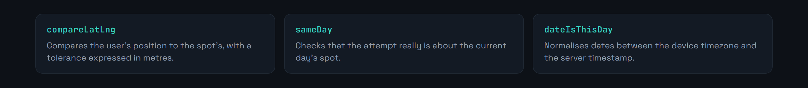

<a id="screens"></a>
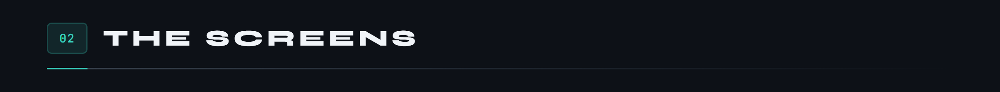

Three tabs at the bottom, Leaderboard, Today and Profile, and two screens that open on top: the photo, then the validation. Every screenshot comes from the demo build.

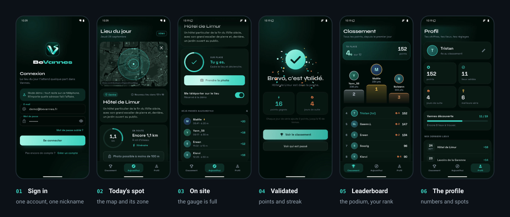

Every animation has a job: a radar marks the spot on the map, a gauge fills as you get closer, a shine sweeps the button once it becomes useful, and a validation is celebrated with a tick that draws itself and a burst of confetti. Screens settle in block by block, and the podium steps rise.



The palette fits in one colour: the teal of the logo, `#39D2C0`, on an almost black background. The orange of the flame is kept for streaks.

<a id="install"></a>
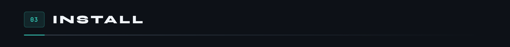

<p align="center">
  <a href="https://github.com/Cybertrist/BeVannes/releases/latest/download/BeVannes.apk">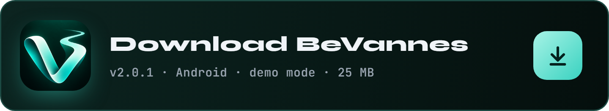</a>
  <a href="https://github.com/Cybertrist/BeVannes/releases/latest/download/BeVannes-demo.apk">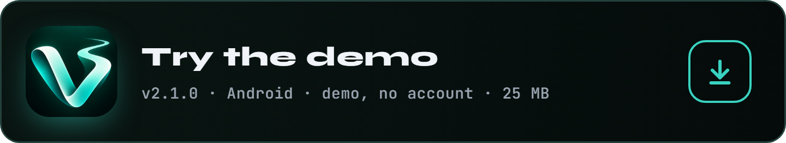</a>
</p>

Two apps, which install side by side without getting in each other's way.

- **BeVannes**, the full version: the real game, connected to the server. One account, with the leaderboard, photos and streaks shared with the other players.
- **BeVannes démo**: a small made-up community, everything stays on the phone, and a "Me téléporter sur le lieu" switch to try validation without crossing Vannes.

Both are signed with the same key; an update installs over the previous one without losing anything. Android 5.0 or later, arm64 processor.

```
# SHA-256 of BeVannes.apk, version 2.1.0
8d25d9ecd2d6d0e5175adf36d63d6e58815335ea5c04ffd7bf8e58b6c87ead7e

# SHA-256 of BeVannes-demo.apk, version 2.1.0
92d5c9d0592950c7ae3c6936ab28e98d11f1b93cf3128b468b4e34d2bfa81eaf

# SHA-256 of the signing certificate, CN=BeVannes, O=Cybertrist
9a8c67645db4e34f4585d84e1db2addf9cbbabc01539bfb4ff57277c0f00feeb
```

**To build it**, you need Flutter. The demo is built with `--dart-define=DEMO=true`, which also gives it its own identifier, `fr.bevannes.bevannes.demo`. An APK built without a Firebase configuration opens in demo mode too: it never starts on an error.

```bash
git clone https://github.com/Cybertrist/BeVannes.git
cd BeVannes
flutter pub get
flutter run --dart-define=DEMO=true
```

**To play for real**, you need a Firebase project. The free plan, Spark, is enough.

1. On the [Firebase console](https://console.firebase.google.com/), enable **Authentication** (email and password) and **Firestore**, and register an Android app `fr.bevannes.bevannes`.
2. Download its `google-services.json`, then write the build configuration, which git ignores:

```bash
bash tool/firebase_env.sh path/to/google-services.json
```

3. Deploy the rules and indexes from the repository:

```bash
firebase deploy --only firestore
```

4. Build:

```bash
flutter build apk --release --dart-define-from-file=firebase.env.json
```

> Client-side Firebase API keys are not secrets, they can be read from any APK. What protects the data are the **rules** in `firestore.rules`, detailed in part 10.

<a id="todays-spot"></a>
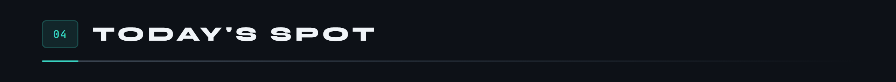

At midnight, every phone works out the spot of the day. Nobody writes it to the database, nobody gets to pick it, and yet everyone lands on the same one.



**The day number** counts the days since 1 January 1970, on the phone's local date: Thursday 24 September 2026 is day 20,720. It changes at midnight, whether the app is open or not.

**The cycle.** With nineteen places, a cycle lasts nineteen days, and each place comes up once. The order of a cycle is a Fisher-Yates shuffle, whose randomness comes from a fixed-seed generator, mulberry32, seeded with the cycle number. It only works on 32 bits: the same maths gives the same result on every phone.

**Never twice in a row.** If the first place of a cycle is the last one of the previous cycle, the first two swap. The `jour_test.dart` test checks over two thousand days that no place comes back the next day.

```dart
int indexDuLieu(int jour, int nb) {
  final cycle = jour ~/ nb;
  final ordre = _ordreDuCycle(cycle, nb);
  final dernierPrecedent = _ordreDuCycle(cycle - 1, nb).last;
  if (ordre.first == dernierPrecedent) {
    ordre[0] = ordre[1];
    ordre[1] = dernierPrecedent;
  }
  return ordre[jour % nb];
}
```

This computation is a contract between every installed phone. A test freezes its results over ten days: if it breaks, older versions and the new one no longer see the same spot.

<a id="on-site"></a>
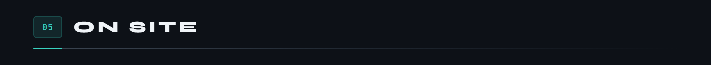

The map shows the spot and its hundred metre zone. The ring fills as you get closer, and the button only lights up once you are inside.


**A hundred metres.** Wide enough to absorb GPS noise between building fronts, tight enough that nobody validates from the next street. The distance comes from the haversine formula, on an Earth with a 6,371 km radius.

**The gauge** follows a logarithmic scale: full at a hundred metres, nearly empty at three kilometres. The last steps count as much as the first kilometre, and the ring still moves when you turn the corner.

**Two readings.** The position is tracked continuously, every three metres of movement, for the ring and the map. When posting, the app asks for a fresh one, with twenty seconds to get it: that is the one that decides.

**A mock location is refused.** Android flags apps that fake the position; the screen says so and the button stays off. If location is switched off or denied, the same screen offers to open the right setting.

<a id="photo"></a>
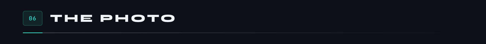

As in BeReal, every photo has the same frame: 3:4 portrait, whatever the camera.



The camera returns whatever it likes, 4:3, 16:9 or square. The app first rotates the image according to its EXIF, since a portrait often arrives lying on its side, then crops it in the centre and scales it to 900 × 1200. The JPEG starts at quality 80; above 700 KB, the quality drops in steps of ten, down to 40. In practice a photo weighs between 100 and 250 KB.

The work happens off the main thread: decoding then re-encoding a JPEG takes a second, and the screen must not freeze meanwhile.

**Why Firestore, not Cloud Storage.** Storage is no longer offered on Firebase's free plan. A 900 × 1200 photo fits easily under the size limit of a Firestore document, 1 MB: it is stored as is, as bytes, and the whole game runs without paying anything.

<a id="wall"></a>
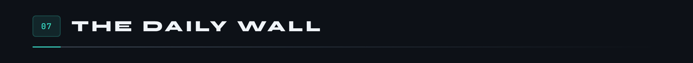

Other players' photos stay locked until you have posted yours.



The list, on the other hand, shows right away: who came by, at what time, how far from the spot, and how many points they earned. Only the pictures wait.

It is not the app that hides the photos, it is the server. The read rule on `photos` only lets an image through if it is your own, or if your own validation for that day exists:

```
allow read: if connecte()
  && (resource.data.uid == request.auth.uid
    || exists(/databases/$(database)/documents/validations/$(string(resource.data.jour) + '_' + request.auth.uid)));
```

A modified app would gain nothing: the database refuses to send the image.

<a id="points"></a>
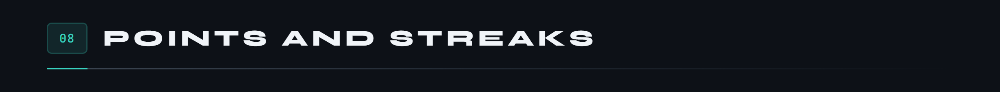

Ten points per spot, two more per day of streak, and the bonus stops at ten.



**The streak** goes on if the last validation was yesterday, and starts again at 1 otherwise. On screen, it drops to zero as soon as a day is missed, without waiting for the next validation. The best streak stays on the profile.

**The cap** is there for newcomers: beyond six days in a row, a validation always pays twenty points, and a player who joined late still has a chance on the leaderboard.

**The leaderboard** shows the top hundred by points, with the podium, your own rank and everyone's current streak.

<a id="reminder"></a>
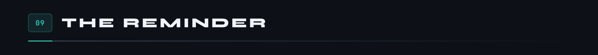

One notification a day, at a time that changes every day but lands at the same moment for everyone.


The time comes out of the same generator as the draw, seeded this time with the day number: one minute out of six hundred, between 10:00 and 19:59. No server sends anything; each phone schedules its own notifications, on Paris time.

Every time it opens, the app schedules the next seven days, skipping a day already validated. The notification names the spot: *"Le lieu du jour : Hôtel de Limur. Sois-y avant minuit."* The reminder can be switched off on the profile.

<a id="rules"></a>
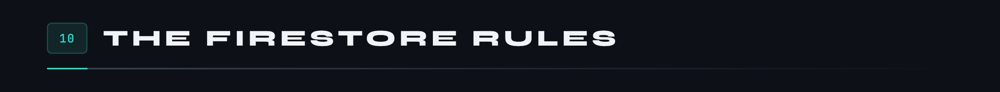

A validation passes through five stations, and it all goes through in one block, or not at all.



The phone writes three documents in a single transaction: the validation, the photo and the updated player. It only proposes: `firestore.rules` redoes the maths of `lib/domain/score.dart` and refuses anything that does not add up.



What the rules check, write by write:

- **The day** must be today, on Paris time: no catching up on yesterday, no getting ahead.
- **The id** of a validation is `{jour}_{uid}`: one per player and per day, with no index and no query.
- **The distance** stored lies between 0 and 100 metres.
- **The photo** carries the same id, weighs under 900 KB, and only exists alongside its validation, written in the same transaction.
- **The points**: streak, gain, total, best streak and validation count are recomputed from the player's previous state.
- **The nickname**: 3 to 20 characters, accented letters included, the same rule as in the app.

A validation is never modified, and only its author can delete it, together with their account.

<a id="privacy"></a>
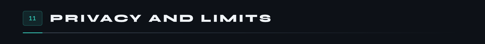


Coordinates never leave the phone: only the distance to the spot, rounded to the metre, is stored. The e-mail stays in Authentication, invisible to other players, who only see a nickname.

Deleting your account asks for the password again, then erases your photos, your validations, your player and finally the account. The password comes first: the server refuses to delete an account whose sign-in is not recent, and it is better to know that before erasing anything.

**The limits**, stated plainly:

- The playing field is Vannes. Anywhere else, there is nothing to discover.
- The position is whatever the phone reports. Android flags mock-location apps, and the game rejects them, but a modified phone can lie without saying so. The Firestore rules guarantee that points add up, not that the player was there.
- Photos are not moderated.
- OpenStreetMap's tiles are not meant for heavy traffic: beyond a circle of friends, it would take a tile server of your own.

<a id="architecture"></a>
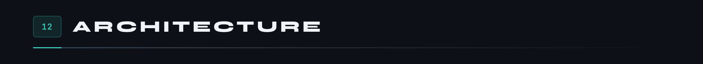

A Flutter app for Android, with Firebase behind it: Authentication for accounts, Firestore for players, validations and photos. The map comes from OpenStreetMap, no API key needed, and the fonts are bundled: no request to Google Fonts.


The code is layered. `lib/domain` holds the game rules, in plain Dart, free of Flutter and Firebase: that is what the tests target. `lib/data` talks to the outside world, and `lib/ui` draws.


**One storage, two versions.** The `Depot` interface describes everything the app expects from its database. `FirebaseDepot` fills it with the real server, `DemoDepot` with eleven made-up Vannes locals in memory, who start from scratch at every launch. `main.dart` picks one or the other, and no screen knows which one it is using.



```
lib/
├── domain/      jour, geo, score, lieu, modeles: the rules, in plain Dart
├── data/        depot, firebase_depot, demo_depot, position, cadrage, rappels, lieux
├── ui/          screens/ (ouverture, connexion, coquille, jour, photo, classement, profil)
│                widgets.dart, animations.dart
├── config/      theme.dart, env.dart
├── providers.dart
├── app.dart     the routes, and the redirect to sign-in
└── main.dart    Firebase or demo, the places, the first screen
```

<a id="places"></a>
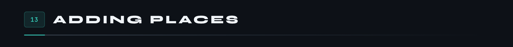

Nineteen places today, from the cathedral to the Conleau headland, each coming up once per cycle.


Places live in `assets/lieux.json`, bundled with the app.

```json
{
  "id": "lavoirs-garenne",
  "nom": "Lavoirs de la Garenne",
  "quartier": "Les remparts",
  "latitude": 47.6555828,
  "longitude": -2.7554577,
  "note": "Sous leurs toits d'ardoise, au bord de la Marle, les lavandières rinçaient le linge jusqu'au milieu du XXe siècle."
}
```

Take the coordinates from OpenStreetMap, not by eye: with a hundred metre radius, a misplaced spot becomes impossible to validate. The `note` is not decoration either, it is what separates a treasure hunt from a visit.

The order of the file feeds the draw: adding a place reshuffles the current cycle. Every player therefore needs the same app version to see the same spot.

<a id="tests"></a>


The tests target what cannot be forgiven: a draw that differs from one phone to another, a streak counted wrong, a wrong distance. They run with no device and no server, in two seconds.

```bash
flutter test
```

The Firestore rules, for their part, were checked against the real server: sign-up, validation, the daily wall and account deletion.

<a id="versions"></a>
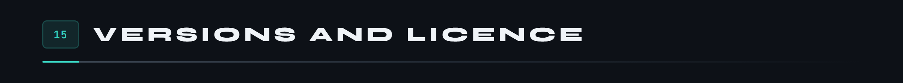


Every Release, with its notes and SHA-256 fingerprints: [github.com/Cybertrist/BeVannes/releases](https://github.com/Cybertrist/BeVannes/releases).

The code is released under the [MIT](LICENSE) licence: free to read, reuse and modify, as long as the copyright notice stays. The Syne and Space Grotesk fonts are under the SIL Open Font licence, map tiles © OpenStreetMap contributors.

**What will never be in this repository:** the APK signing key and the Firebase configuration. `.gitignore` refuses `key.properties`, `.p12`, `.jks` and `.keystore` files, `google-services.json` and `firebase.env.json`.

<br>

<sub>Student project · Université Bretagne Sud, Vannes · Tristan Joncour. The images on this page come out of no drawing software: HTML pages captured by Chrome, and eighteen SVGs written by <code>anime.js</code>, seventeen of them animated. It is all in <a href="docs/tools/">docs/tools</a>.</sub>
