<div align="center">

<p>
  
  <a href="README.en.md"></a>
</p>

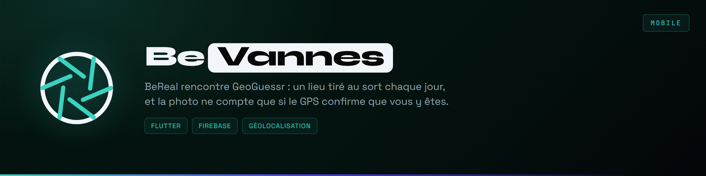

</div>

**BeReal rencontre GeoGuessr : un lieu par jour, il faut y aller pour marquer.**

Chaque jour, l'application désigne un lieu de Vannes, le même pour tout le monde. Pour marquer des points, il faut s'y rendre : la photo n'est acceptée qu'à moins de cent mètres du lieu, GPS à l'appui. Chaque lieu s'accompagne d'une courte note historique, ce qui transforme la partie en visite guidée sans le vouloir.

L'idée de départ : on passe devant les mêmes rues tous les jours sans jamais s'arrêter. Une contrainte ludique suffit parfois à changer ça.

<p align="center"><a href="https://github.com/Cybertrist/BeVannes/releases/latest/download/BeVannes.apk">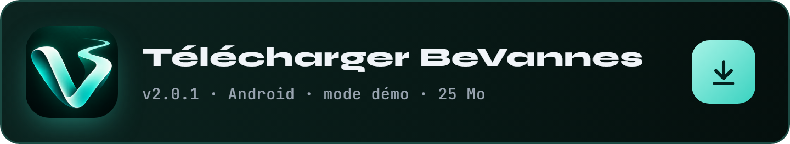</a></p>


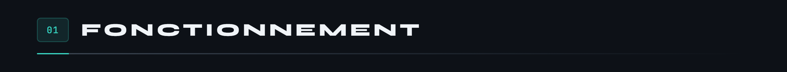

Une partie tient en quatre temps.

**Le tirage.** À minuit, chaque téléphone calcule le lieu du jour. Personne ne l'écrit dans la base, personne ne peut le choisir.


**Sur place.** La carte montre le lieu et sa zone de cent mètres. L'anneau se remplit à mesure qu'on approche, et le bouton ne s'allume qu'une fois dedans.


**Le mur du jour.** Les photos des autres restent verrouillées tant qu'on n'a pas publié la sienne.


**Le rappel.** Une notification par jour, à une heure qui change tous les jours mais tombe au même moment pour tout le monde.



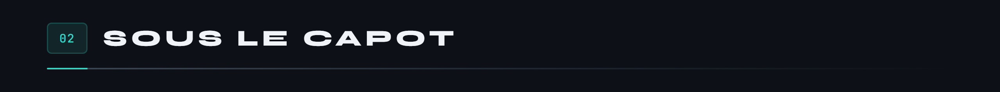

Une application Flutter pour Android, avec Firebase derrière : Authentication pour les comptes, Firestore pour les joueurs et les validations, Storage pour les photos. La carte vient d'OpenStreetMap, sans clé d'API.

Trois pièces tiennent le jeu.

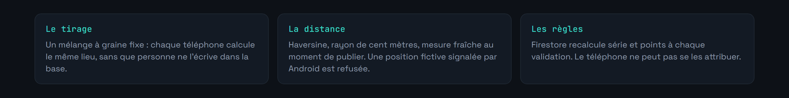

Une validation traverse cinq étapes, et tout passe d'un bloc ou rien ne passe.


Le téléphone ne fait que proposer ses points : Firestore refait le calcul et refuse ce qui ne tombe pas juste.


Les points se calculent au jour près : dix par lieu, deux de plus par jour de série, et le bonus s'arrête à dix.


Les photos, elles, sont toutes au même format, quel que soit l'appareil.


Le code est rangé en couches : `lib/domain` pour les règles du jeu, sans Flutter ni Firebase, et testé ; `lib/data` pour le stockage, avec une version Firebase et une version de démonstration en mémoire ; `lib/ui` pour les écrans.

Côté interface, chaque animation a un rôle : un radar marque le lieu sur la carte, une jauge se remplit en approchant, un reflet passe sur le bouton quand il devient utile, et la validation se fête avec une coche qui se dessine et une gerbe de confettis. Les écrans s'installent bloc par bloc, et les marches du podium montent.

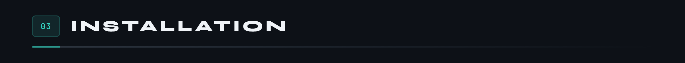

**Pour essayer**, le bouton en haut de page installe la version de démonstration : une petite communauté fictive, tout reste sur le téléphone, et un interrupteur place le joueur sur le lieu du jour pour tester la validation sans traverser la ville.

**Pour construire**, il faut Flutter.

```bash
git clone https://github.com/Cybertrist/BeVannes.git
cd BeVannes
flutter pub get
flutter run --dart-define=DEMO=true
```

**Pour jouer pour de vrai**, il faut un projet Firebase.

1. Sur la [console Firebase](https://console.firebase.google.com/), activer **Authentication** (e-mail et mot de passe), **Firestore** et **Storage**, et déclarer une application Android `fr.bevannes.bevannes`.
2. Télécharger son `google-services.json`, puis écrire la configuration de compilation, ignorée par git :

```bash
bash tool/firebase_env.sh chemin/vers/google-services.json
```

3. Déployer les règles et les index du dépôt :

```bash
firebase deploy --only firestore,storage
```

4. Construire :

```bash
flutter build apk --release --dart-define-from-file=firebase.env.json
```

> Les clés d'API Firebase côté client ne sont pas des secrets, elles se lisent dans tout APK. Ce qui protège les données, ce sont les **règles** de `firestore.rules` et `storage.rules` : un joueur n'écrit que ses propres points, recalculés par le serveur, et ne voit les photos d'un jour qu'après avoir validé ce jour-là.

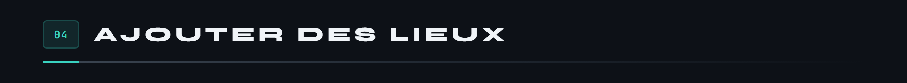

Dix-neuf lieux aujourd'hui, de la cathédrale à la pointe de Conleau, qui passent chacun une fois par cycle.


Les lieux vivent dans `assets/lieux.json`, embarqués dans l'application.

```json
{
  "id": "lavoirs-garenne",
  "nom": "Lavoirs de la Garenne",
  "quartier": "Les remparts",
  "latitude": 47.6555828,
  "longitude": -2.7554577,
  "note": "Sous leurs toits d'ardoise, au bord de la Marle, les lavandières rinçaient le linge jusqu'au milieu du XXe siècle."
}
```

Les coordonnées se prennent sur OpenStreetMap, pas à l'œil : à cent mètres près, un lieu mal placé devient impossible à valider. La `note` n'est pas décorative non plus, c'est elle qui fait la différence entre une chasse au trésor et une visite.

L'ordre du fichier entre dans le tirage : ajouter un lieu rebat le cycle en cours. Tous les joueurs doivent donc avoir la même version de l'application pour voir le même lieu.

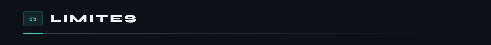

Le terrain de jeu est Vannes. Ailleurs, il n'y a rien à découvrir.

La position reste celle que le téléphone annonce. Android signale les applications de position fictive, et le jeu les refuse, mais un téléphone modifié peut mentir sans le dire. Les règles Firestore garantissent la cohérence des points, pas la présence sur place.

Les photos ne sont pas modérées, et les tuiles d'OpenStreetMap ne sont pas faites pour un gros trafic : au-delà d'un cercle d'amis, il faudrait un serveur de tuiles à soi.

Écrit en Flutter et Dart, avec Firebase. Licence MIT.

---

<sub>Projet étudiant · Université Bretagne Sud, Vannes · Tristan Joncour</sub>
