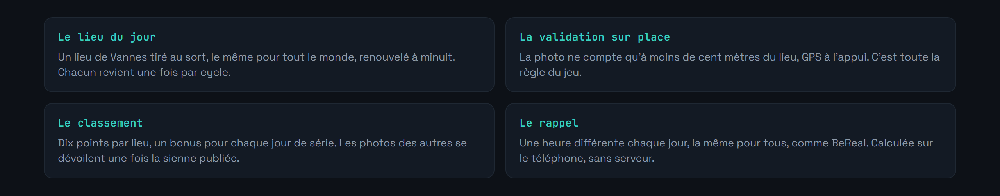
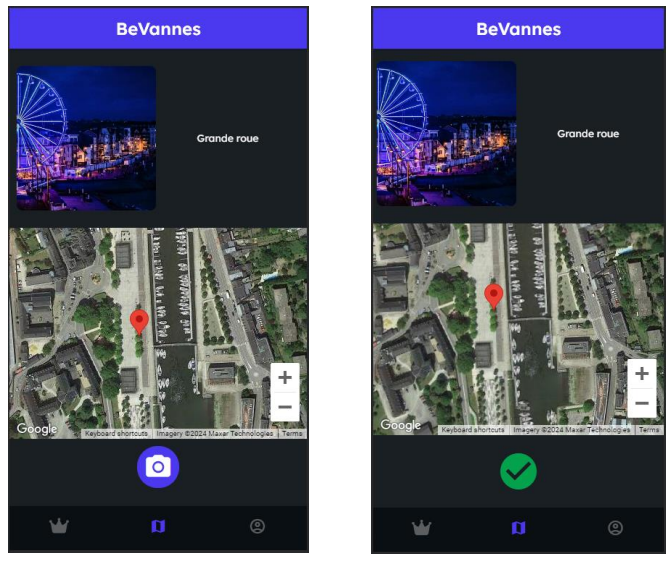
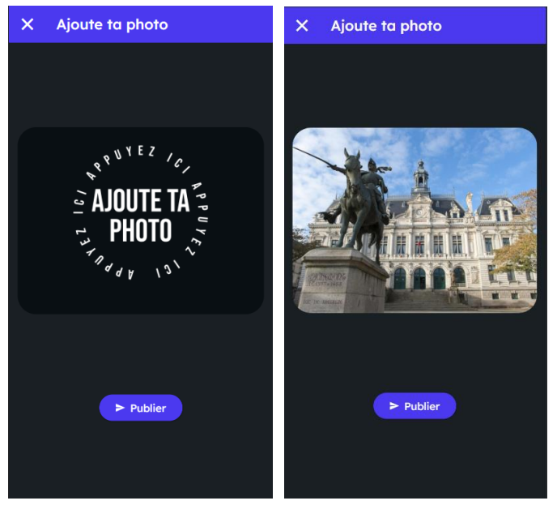
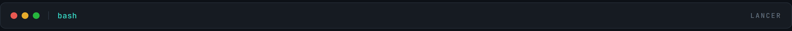
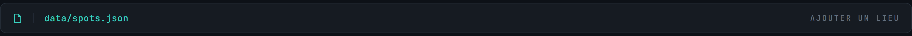

<div align="center">


</div>

**BeReal rencontre GeoGuessr : un lieu par jour, il faut y aller pour marquer.**

Chaque jour, l'application tire un lieu au sort dans Vannes et ses environs. Pour marquer des points, il faut s'y rendre physiquement : la position GPS est comparée à celle du spot, et la photo n'est validée que si vous y êtes vraiment. Chaque lieu s'accompagne d'une note historique ou culturelle, ce qui transforme la partie en visite guidée sans le vouloir.

L'idée de départ : on passe devant les mêmes rues tous les jours sans jamais s'arrêter. Une contrainte ludique suffit parfois à changer ça.




<div align="center">






</div>


Développé avec Flutter, prototypé sur FlutterFlow, adossé à Firebase pour l'authentification, la base temps réel et les tâches planifiées.

Trois fonctions maison portent la logique de jeu.


C'est là que tout se joue. Une tolérance trop large et on valide depuis son canapé, trop étroite et le bruit GPS en ville rend le jeu injouable.


```bash
git clone https://github.com/Cybertrist/BeVannes.git
cd BeVannes
flutter pub get
```

**Firebase.** Le projet a besoin de votre propre projet Firebase : les fichiers de configuration ne sont pas versionnés.

1. Créez un projet sur la [console Firebase](https://console.firebase.google.com/).
2. Activez **Authentication**, **Realtime Database** et **Storage**.
3. Téléchargez `google-services.json` et placez-le dans `android/app/`.
4. Pour iOS, `GoogleService-Info.plist` va dans `ios/Runner/`.

> Les clés d'API Firebase côté client ne sont pas des secrets, elles sont lisibles dans tout APK. Ce qui protège réellement les données, ce sont les **règles de sécurité** Realtime Database et Storage. Configurez-les avant d'ouvrir l'application à qui que ce soit.



```bash
flutter run
```


Les spots sont décrits dans `data/spots.json`.



```json
{
  "spots": [
    {
      "name": "Les remparts",
      "latitude": 47.6553,
      "longitude": -2.7601,
      "description": "Fortifications médiévales, parmi les mieux conservées de Bretagne."
    }
  ]
}
```

La `description` n'est pas décorative : c'est elle qui fait la différence entre une chasse au trésor et une visite. Elle mérite qu'on la soigne.


Le périmètre couvert est Vannes et ses alentours. Ailleurs, il n'y a rien à découvrir.

La validation repose sur le GPS de l'appareil, qui reste falsifiable par une application de position fictive. Une vérification sérieuse demanderait un recoupement côté serveur, sur l'heure de la prise de vue et la cohérence des déplacements.

Le projet est né d'un prototype FlutterFlow, et une partie du code généré n'a pas été reprise à la main.

Écrit en Flutter et Dart, avec Firebase. Licence MIT.

---

<sub>Projet étudiant · Université Bretagne Sud, Vannes · Tristan Joncour</sub>
