<div align="center">

<p>
  
  <a href="README.en.md"></a>
</p>

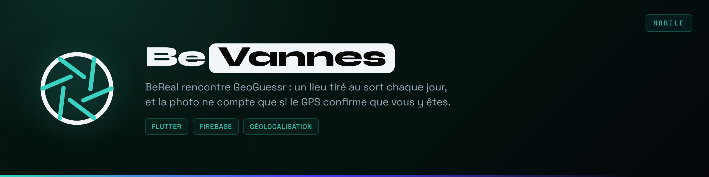
<br><br>

**BeReal rencontre GeoGuessr : un lieu par jour, il faut y aller pour marquer.**

</div>

Chaque jour, l'application désigne un lieu de Vannes, le même pour tout le monde. Pour marquer des points, il faut s'y rendre : la photo n'est acceptée qu'à moins de cent mètres du lieu, GPS à l'appui. Chaque lieu s'accompagne d'une courte note historique, ce qui transforme la partie en visite guidée sans le vouloir.

L'idée de départ : on passe devant les mêmes rues tous les jours sans jamais s'arrêter. Une contrainte ludique suffit parfois à changer ça.

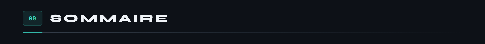

<p align="center">
<a href="#fonctionnalites">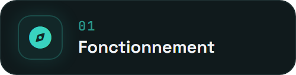</a>
<a href="#ecrans">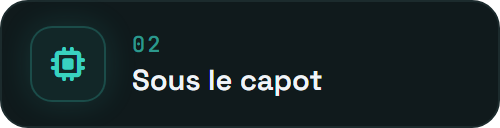</a>
<a href="#installer">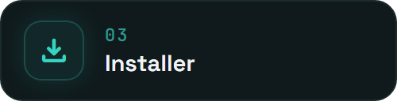</a>
<br>
<a href="#lieu-du-jour"></a>
<a href="#sur-place"></a>
<a href="#photo">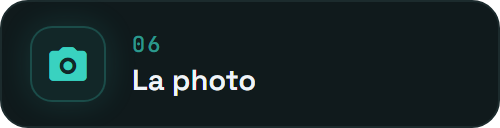</a>
<br>
<a href="#mur">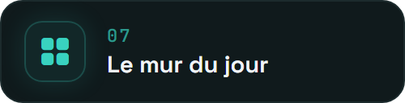</a>
<a href="#points">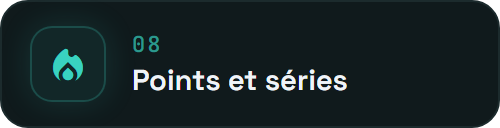</a>
<a href="#rappel"></a>
<br>
<a href="#regles">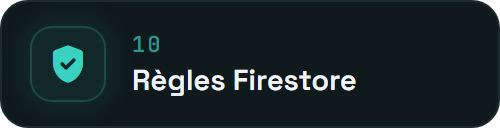</a>
<a href="#confidentialite"></a>
<a href="#architecture">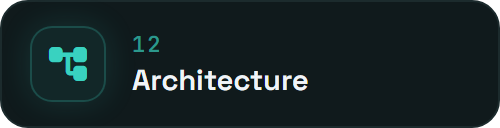</a>
<br>
<a href="#lieux"></a>
<a href="#tests">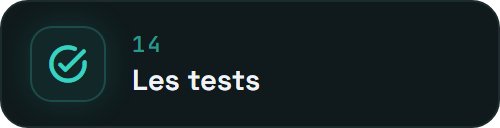</a>
<a href="#versions"></a>
</p>

<a id="fonctionnalites"></a>
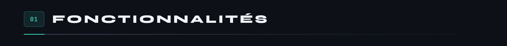


Trois pièces tiennent le jeu, et chacune a sa partie plus bas.

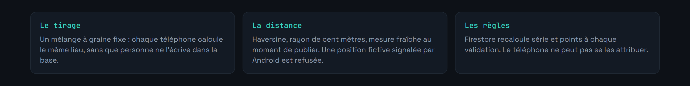

<a id="ecrans"></a>
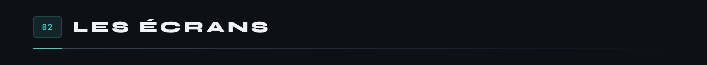

Trois onglets en bas, Classement, Aujourd'hui et Profil, et deux écrans qui s'ouvrent par-dessus : la photo, puis la validation. Toutes les captures viennent de la version de démonstration.

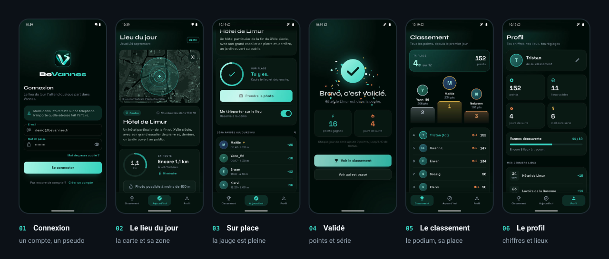

Chaque animation a un rôle : un radar marque le lieu sur la carte, une jauge se remplit en approchant, un reflet passe sur le bouton quand il devient utile, et la validation se fête avec une coche qui se dessine et une gerbe de confettis. Les écrans s'installent bloc par bloc, et les marches du podium montent.



La palette tient en une couleur : le sarcelle du logo, `#39D2C0`, sur un fond presque noir. L'orange de la flamme est réservé aux séries.

<a id="installer"></a>
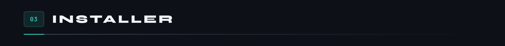

<p align="center">
  <a href="https://github.com/Cybertrist/BeVannes/releases/latest/download/BeVannes.apk">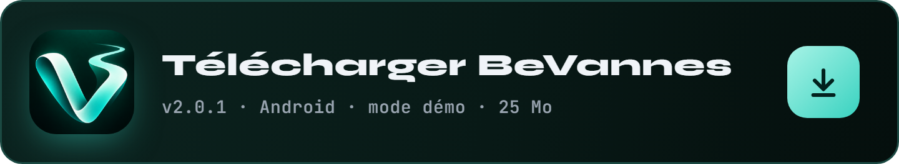</a>
  <a href="https://github.com/Cybertrist/BeVannes/releases/latest/download/BeVannes-demo.apk">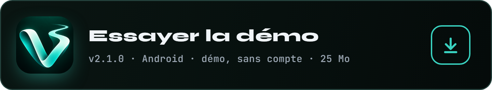</a>
</p>

Deux applications, qui s'installent côte à côte sans se gêner.

- **BeVannes**, la version complète : le vrai jeu, relié au serveur. Un compte, le classement, les photos et les séries partagés avec les autres joueurs.
- **BeVannes démo** : une petite communauté fictive, tout reste sur le téléphone, et un interrupteur « Me téléporter sur le lieu » pour essayer la validation sans traverser Vannes.

Les deux sont signées par la même clé ; une mise à jour s'installe par-dessus la précédente sans rien perdre. Android 5.0 ou plus, processeur arm64.

```
# SHA-256 de BeVannes.apk, version 2.1.0
8d25d9ecd2d6d0e5175adf36d63d6e58815335ea5c04ffd7bf8e58b6c87ead7e

# SHA-256 de BeVannes-demo.apk, version 2.1.0
92d5c9d0592950c7ae3c6936ab28e98d11f1b93cf3128b468b4e34d2bfa81eaf

# SHA-256 du certificat de signature, CN=BeVannes, O=Cybertrist
9a8c67645db4e34f4585d84e1db2addf9cbbabc01539bfb4ff57277c0f00feeb
```

**Pour construire**, il faut Flutter. La démo se construit avec `--dart-define=DEMO=true`, qui lui donne aussi son propre identifiant, `fr.bevannes.bevannes.demo`. Un APK construit sans configuration Firebase s'ouvre lui aussi en démo : il ne démarre jamais sur une erreur.

```bash
git clone https://github.com/Cybertrist/BeVannes.git
cd BeVannes
flutter pub get
flutter run --dart-define=DEMO=true
```

**Pour jouer pour de vrai**, il faut un projet Firebase. Le forfait gratuit, Spark, suffit.

1. Sur la [console Firebase](https://console.firebase.google.com/), activer **Authentication** (e-mail et mot de passe) et **Firestore**, et déclarer une application Android `fr.bevannes.bevannes`.
2. Télécharger son `google-services.json`, puis écrire la configuration de compilation, ignorée par git :

```bash
bash tool/firebase_env.sh chemin/vers/google-services.json
```

3. Déployer les règles et les index du dépôt :

```bash
firebase deploy --only firestore
```

4. Construire :

```bash
flutter build apk --release --dart-define-from-file=firebase.env.json
```

> Les clés d'API Firebase côté client ne sont pas des secrets, elles se lisent dans tout APK. Ce qui protège les données, ce sont les **règles** de `firestore.rules`, détaillées dans la partie 10.

<a id="lieu-du-jour"></a>
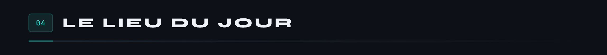

À minuit, chaque téléphone calcule le lieu du jour. Personne ne l'écrit dans la base, personne ne peut le choisir, et pourtant tout le monde tombe sur le même.



**Le numéro du jour** compte les jours depuis le 1er janvier 1970, sur la date locale du téléphone : le jeudi 24 septembre 2026 est le jour 20 720. Il change à minuit, application ouverte ou non.

**Le cycle.** Avec dix-neuf lieux, un cycle dure dix-neuf jours, et chaque lieu y passe une fois. L'ordre du cycle est un mélange de Fisher-Yates, dont le hasard vient d'un générateur à graine fixe, mulberry32, semé par le numéro du cycle. Il ne travaille que sur 32 bits : le même calcul donne le même résultat sur tous les téléphones.

**Jamais deux fois de suite.** Si le premier lieu d'un cycle est le dernier du précédent, les deux premiers s'échangent. Le test `jour_test.dart` vérifie sur deux mille jours qu'aucun lieu ne revient le lendemain.

```dart
int indexDuLieu(int jour, int nb) {
  final cycle = jour ~/ nb;
  final ordre = _ordreDuCycle(cycle, nb);
  final dernierPrecedent = _ordreDuCycle(cycle - 1, nb).last;
  if (ordre.first == dernierPrecedent) {
    ordre[0] = ordre[1];
    ordre[1] = dernierPrecedent;
  }
  return ordre[jour % nb];
}
```

Ce calcul est un contrat entre tous les téléphones installés. Un test fige ses résultats sur dix jours : s'il casse, les anciennes versions et la nouvelle ne voient plus le même lieu.

<a id="sur-place"></a>
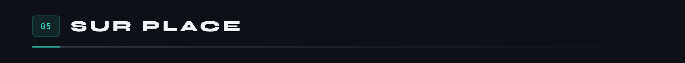

La carte montre le lieu et sa zone de cent mètres. L'anneau se remplit à mesure qu'on approche, et le bouton ne s'allume qu'une fois dedans.



**Cent mètres.** Assez large pour absorber le bruit du GPS entre les façades, assez serré pour qu'on ne valide pas depuis la rue d'à côté. La distance se calcule par la formule de haversine, sur une Terre de 6 371 km de rayon.

**La jauge** suit une échelle logarithmique : pleine à cent mètres, presque vide à trois kilomètres. Les derniers pas comptent autant que le premier kilomètre, et l'anneau bouge encore quand on tourne au coin de la rue.

**Deux mesures.** La position est suivie en continu, à chaque déplacement de trois mètres, pour l'anneau et la carte. Au moment de publier, l'application en redemande une fraîche, avec vingt secondes pour l'obtenir : c'est celle-là qui décide.

**Une position fictive est refusée.** Android signale les applications qui simulent la position ; l'écran l'annonce et le bouton reste éteint. Si la localisation est coupée ou refusée, le même écran propose d'ouvrir le bon réglage.

<a id="photo"></a>


Comme dans BeReal, toutes les photos ont le même cadre : 3:4 en portrait, quel que soit l'appareil photo.



L'appareil rend ce qu'il veut, 4:3, 16:9 ou carré. L'application redresse d'abord l'image selon son EXIF, car un portrait arrive souvent couché, puis la recadre au centre et la réduit à 900 × 1200. Le JPEG part en qualité 80 ; s'il dépasse 700 Ko, la qualité descend par paliers de dix, jusqu'à 40. En pratique, une photo pèse entre 100 et 250 Ko.

Le travail se fait hors du fil principal : décoder puis réencoder un JPEG prend une seconde, et l'écran ne doit pas se figer pendant ce temps.

**Pourquoi Firestore, et pas Cloud Storage.** Storage n'est plus offert sur le forfait gratuit de Firebase. Une photo de 900 × 1200 tient largement sous la limite d'un document Firestore, 1 Mo : elle y est rangée telle quelle, en octets, et tout le jeu tourne sans rien payer.

<a id="mur"></a>
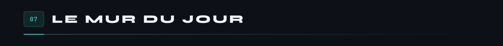

Les photos des autres restent verrouillées tant qu'on n'a pas publié la sienne.



La liste, elle, se voit tout de suite : qui est passé, à quelle heure, à quelle distance du lieu, et combien de points il a gagnés. Seules les images attendent.

Ce n'est pas l'application qui cache les photos, c'est le serveur. La règle de lecture de `photos` ne laisse passer une image que si elle est à soi, ou si sa propre validation du jour existe :

```
allow read: if connecte()
  && (resource.data.uid == request.auth.uid
    || exists(/databases/$(database)/documents/validations/$(string(resource.data.jour) + '_' + request.auth.uid)));
```

Une application modifiée n'y gagnerait rien : la base refuse d'envoyer l'image.

<a id="points"></a>
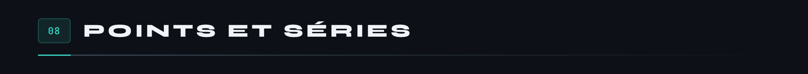

Dix points par lieu, deux de plus par jour de série, et le bonus s'arrête à dix.



**La série** continue si la dernière validation date de la veille, et repart à 1 sinon. Affichée, elle tombe à zéro dès qu'un jour a été manqué, sans attendre la validation suivante. La meilleure série reste dans le profil.

**Le plafond** est là pour les nouveaux venus : au-delà de six jours de suite, une validation rapporte toujours vingt points, et un joueur arrivé tard garde une chance au classement.

**Le classement** montre les cent premiers par points, avec le podium, sa propre place et la série en cours de chacun.

<a id="rappel"></a>
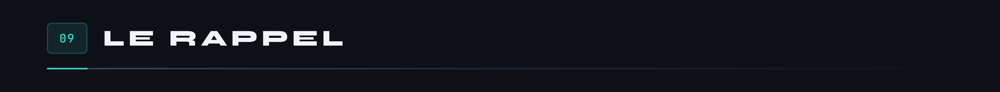

Une notification par jour, à une heure qui change tous les jours mais tombe au même moment pour tout le monde.



L'heure sort du même générateur que le tirage, semé cette fois par le numéro du jour : une minute parmi six cents, entre 10 h et 19 h 59. Aucun serveur n'envoie rien, chaque téléphone programme ses propres notifications, à l'heure de Paris.

À chaque ouverture, l'application programme les sept jours à venir, et saute le jour déjà validé. La notification annonce le lieu : *« Le lieu du jour : Hôtel de Limur. Sois-y avant minuit. »* Le rappel se coupe dans le profil.

<a id="regles"></a>
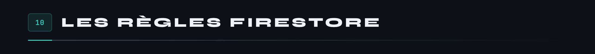

Une validation traverse cinq postes, et tout passe d'un bloc, ou rien.



Le téléphone écrit trois documents dans une seule transaction : la validation, la photo et le joueur mis à jour. Il ne fait que proposer : `firestore.rules` refait le calcul de `lib/domain/score.dart` et refuse tout ce qui ne tombe pas juste.



Ce que les règles vérifient, écriture par écriture :

- **Le jour** doit être aujourd'hui, à l'heure de Paris : ni rattraper hier, ni prendre de l'avance.
- **L'identifiant** d'une validation est `{jour}_{uid}` : une seule par joueur et par jour, sans index ni requête.
- **La distance** enregistrée est comprise entre 0 et 100 mètres.
- **La photo** porte le même identifiant, pèse moins de 900 Ko, et n'existe qu'avec sa validation, écrite dans la même transaction.
- **Les points** : la série, le gain, le total, la meilleure série et le nombre de validations sont recalculés à partir de l'état précédent du joueur.
- **Le pseudo** : de 3 à 20 caractères, lettres accentuées comprises, la même règle que dans l'application.

Une validation ne se modifie jamais, et seul son auteur peut la supprimer, avec son compte.

<a id="confidentialite"></a>
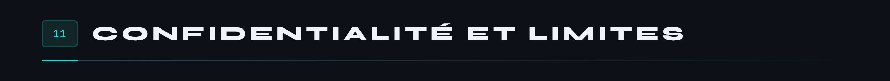


Les coordonnées ne quittent jamais le téléphone : seule la distance au lieu, arrondie au mètre, est enregistrée. L'e-mail reste dans Authentication, invisible des autres joueurs, qui ne voient qu'un pseudo.

Supprimer son compte redemande le mot de passe, puis efface ses photos, ses validations, son joueur et enfin le compte. Le mot de passe passe en premier : le serveur refuse de supprimer un compte dont la connexion n'est pas récente, et mieux vaut le savoir avant d'avoir effacé quoi que ce soit.

**Les limites**, dites franchement :

- Le terrain de jeu est Vannes. Ailleurs, il n'y a rien à découvrir.
- La position reste celle que le téléphone annonce. Android signale les applications de position fictive, et le jeu les refuse, mais un téléphone modifié peut mentir sans le dire. Les règles Firestore garantissent la cohérence des points, pas la présence sur place.
- Les photos ne sont pas modérées.
- Les tuiles d'OpenStreetMap ne sont pas faites pour un gros trafic : au-delà d'un cercle d'amis, il faudrait un serveur de tuiles à soi.

<a id="architecture"></a>


Une application Flutter pour Android, avec Firebase derrière : Authentication pour les comptes, Firestore pour les joueurs, les validations et les photos. La carte vient d'OpenStreetMap, sans clé d'API, et les polices sont embarquées : aucune requête vers Google Fonts.


Le code est rangé en couches. `lib/domain` porte les règles du jeu, en Dart pur, sans Flutter ni Firebase : c'est lui que les tests visent. `lib/data` parle au monde extérieur, et `lib/ui` dessine.


**Un stockage, deux versions.** L'interface `Depot` décrit tout ce que l'application attend de sa base. `FirebaseDepot` la remplit avec le vrai serveur, `DemoDepot` avec onze Vannetais fictifs en mémoire, qui repartent de zéro à chaque lancement. `main.dart` choisit l'une ou l'autre, et aucun écran ne sait laquelle il utilise.


```
lib/
├── domain/      jour, geo, score, lieu, modeles : les règles, en Dart pur
├── data/        depot, firebase_depot, demo_depot, position, cadrage, rappels, lieux
├── ui/          screens/ (ouverture, connexion, coquille, jour, photo, classement, profil)
│                widgets.dart, animations.dart
├── config/      theme.dart, env.dart
├── providers.dart
├── app.dart     les routes, et la redirection vers la connexion
└── main.dart    Firebase ou démo, les lieux, le premier écran
```

<a id="lieux"></a>
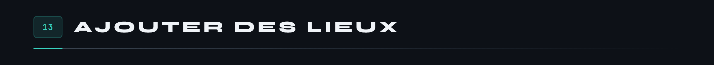

Dix-neuf lieux aujourd'hui, de la cathédrale à la pointe de Conleau, qui passent chacun une fois par cycle.


Les lieux vivent dans `assets/lieux.json`, embarqués dans l'application.

```json
{
  "id": "lavoirs-garenne",
  "nom": "Lavoirs de la Garenne",
  "quartier": "Les remparts",
  "latitude": 47.6555828,
  "longitude": -2.7554577,
  "note": "Sous leurs toits d'ardoise, au bord de la Marle, les lavandières rinçaient le linge jusqu'au milieu du XXe siècle."
}
```

Les coordonnées se prennent sur OpenStreetMap, pas à l'œil : à cent mètres près, un lieu mal placé devient impossible à valider. La `note` n'est pas décorative non plus, c'est elle qui fait la différence entre une chasse au trésor et une visite.

L'ordre du fichier entre dans le tirage : ajouter un lieu rebat le cycle en cours. Tous les joueurs doivent donc avoir la même version de l'application pour voir le même lieu.

<a id="tests"></a>
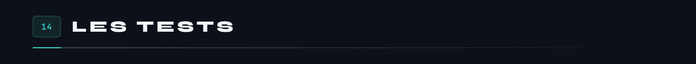


Les tests visent ce qui ne pardonne pas : un tirage qui diverge d'un téléphone à l'autre, une série mal comptée, une distance fausse. Ils tournent sans appareil ni serveur, en deux secondes.

```bash
flutter test
```

Les règles Firestore, elles, ont été vérifiées sur le vrai serveur : inscription, validation, mur du jour et suppression du compte.

<a id="versions"></a>
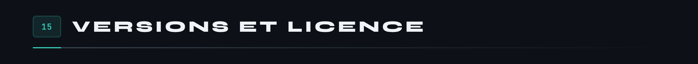


Chaque Release, avec ses notes et ses empreintes SHA-256 : [github.com/Cybertrist/BeVannes/releases](https://github.com/Cybertrist/BeVannes/releases).

Le code est publié sous licence [MIT](LICENSE) : libre de le lire, de le reprendre et de le modifier, à condition de garder la mention de copyright. Les polices Syne et Space Grotesk sont sous licence SIL Open Font, les tuiles de carte © les contributeurs d'OpenStreetMap.

**Ce qui ne sera jamais dans ce dépôt :** la clé de signature de l'APK et la configuration Firebase. `.gitignore` refuse `key.properties`, les fichiers `.p12`, `.jks` et `.keystore`, `google-services.json` et `firebase.env.json`.

<br>

<sub>Projet étudiant · Université Bretagne Sud, Vannes · Tristan Joncour. Les images de cette page ne sortent d'aucun logiciel de dessin : des pages HTML que Chrome capture, et dix-huit SVG écrits par <code>anime.js</code>, dont dix-sept animés. Tout est dans <a href="docs/tools/">docs/tools</a>.</sub>
